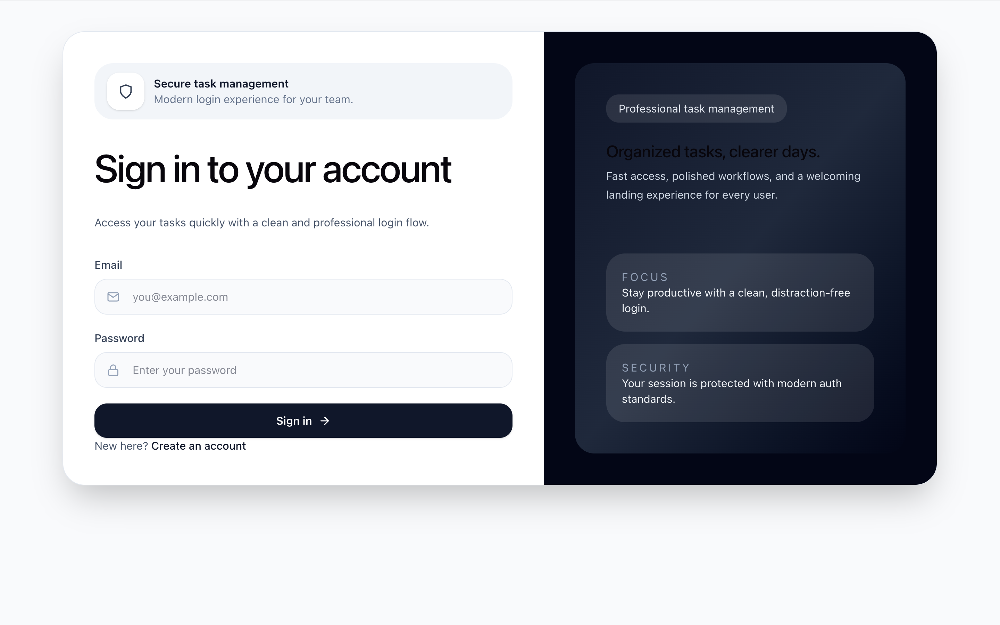
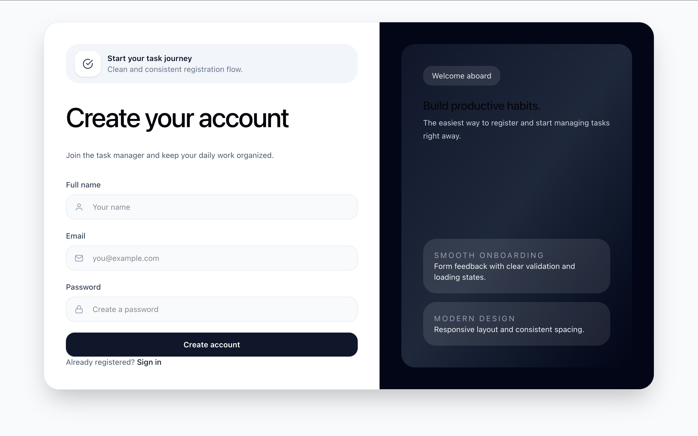
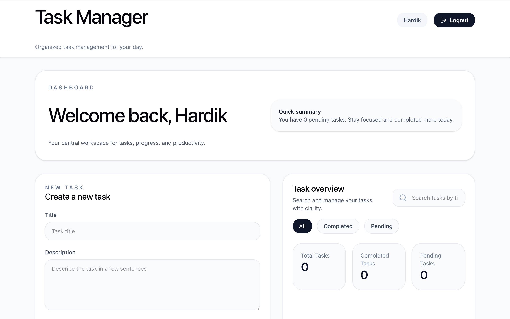
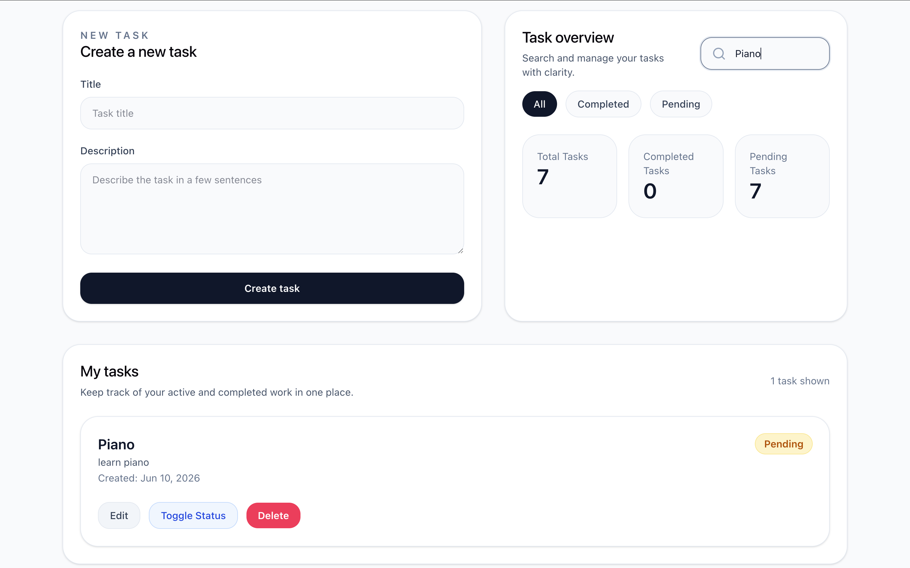
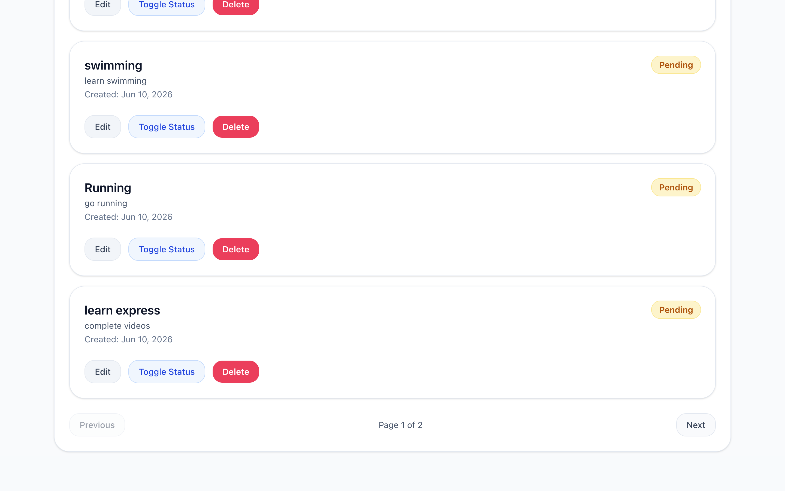

# 🚀 MERN Task Manager

A full-stack Task Management application built using the **MERN Stack** (MongoDB, Express.js, React, Node.js) that allows users to securely manage their personal tasks with JWT authentication, modern UI, search, filtering, and pagination.

## 🌐 Live Demo

* **Frontend:** https://task-manager-mern-vert-kappa.vercel.app/
* **Backend API:** https://task-manager-backend-m3oo.onrender.com

---

## ✨ Features

### 🔐 Authentication

* User Registration
* User Login
* JWT-based Authentication
* Protected Routes
* Secure User Sessions

### 📋 Task Management

* Create Tasks
* View All Tasks
* Update Existing Tasks
* Delete Tasks
* Toggle Task Status (Completed / Pending)

### 🎯 Bonus Features

* 🔍 Search Tasks
* 🗂️ Filter Tasks (All / Completed / Pending)
* 📄 Pagination
* 📊 Task Statistics (Total, Completed, Pending)
* 🔔 Toast Notifications
* ⏳ Loading States
* 🗑️ Delete Confirmation
* 📱 Fully Responsive Design

---

## 🛠️ Tech Stack

### Frontend

* React
* Vite
* Tailwind CSS
* React Router DOM
* Axios
* React Hot Toast

### Backend

* Node.js
* Express.js
* MongoDB Atlas
* Mongoose
* JSON Web Token (JWT)
* bcryptjs

---

## 📁 Project Structure

```text
task-manager-app/
│
├── backend/
│   ├── config/
│   ├── controllers/
│   ├── middleware/
│   ├── models/
│   ├── routes/
│   ├── server.js
│   └── package.json
│
└── frontend/
    ├── src/
    │   ├── components/
    │   ├── pages/
    │   ├── services/
    │   ├── context/
    │   └── routes/
    ├── public/
    └── package.json
```

---

## ⚙️ Installation & Setup

### 1. Clone the Repository

```bash
git clone https://github.com/HardikJangra/task-manager-mern.git
cd task-manager-app
```

---

## Backend Setup

```bash
cd backend
npm install
```

Create a `.env` file inside the backend folder:

```env
PORT=5000
MONGODB_URI=your_mongodb_connection_string
JWT_SECRET=your_secret_key
```

Start the backend:

```bash
npm run dev
```

---

## Frontend Setup

```bash
cd frontend
npm install
```

Create a `.env` file inside the frontend folder:

```env
VITE_API_URL=http://localhost:5000/api
```

Start the frontend:

```bash
npm run dev
```

The application will run at:

```
http://localhost:5173
```

---

## 📡 API Endpoints

### Authentication

| Method | Endpoint             | Description         |
| ------ | -------------------- | ------------------- |
| POST   | `/api/auth/register` | Register a new user |
| POST   | `/api/auth/login`    | Login user          |

### Tasks

| Method | Endpoint                | Description        |
| ------ | ----------------------- | ------------------ |
| GET    | `/api/tasks`            | Get all user tasks |
| POST   | `/api/tasks`            | Create a new task  |
| PUT    | `/api/tasks/:id`        | Update a task      |
| DELETE | `/api/tasks/:id`        | Delete a task      |
| PATCH  | `/api/tasks/:id/toggle` | Toggle task status |

---

## 📸 Screenshots

### 🔐 Login Page



---

### 📝 Register Page



---

### 📊 Dashboard



---

### 🔍 Search & Filter



---

### 📄 Pagination


---

## 🔒 Authentication Flow

1. User registers with name, email, and password.
2. Password is securely hashed before storage.
3. User logs in and receives a JWT token.
4. Token is stored on the client.
5. Every protected API request includes the token in the `Authorization` header.
6. Backend verifies the token before allowing access.

---

## 🚀 Deployment

* **Frontend:** Vercel
* **Backend:** Render
* **Database:** MongoDB Atlas

---

## 🎯 Future Improvements

* Task Categories
* Due Dates
* Drag & Drop Task Ordering
* Email Notifications
* Dark Mode
* User Profile Management

---

## 👨‍💻 Author

**Hardik Jangra**

* GitHub: https://github.com/HardikJangra
* LinkedIn: https://www.linkedin.com/in/hardik-jangra-45462428b/

---

## 📄 License

This project is created for educational and internship assignment purposes.
